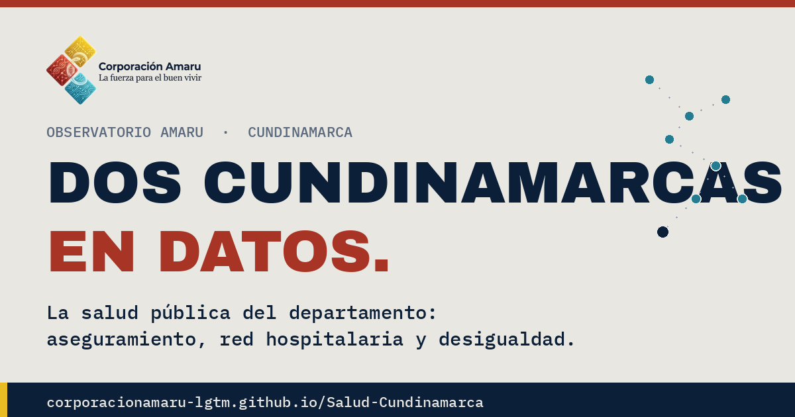

# Dos Cundinamarcas, en datos

> Una pieza del **Observatorio Amaru** sobre la salud pública de Cundinamarca.

### 🔗 Ver la pieza en vivo → https://corporacionamaru-lgtm.github.io/Salud-Cundinamarca/

---

## De qué se trata

Un mismo departamento, dos realidades de salud: la Sabana y los cascos urbanos, con empleo formal y más opciones de EPS; y la periferia rural, que depende del subsidio y de una red pública en tensión.

Esta pieza reúne los datos —de dónde salen y qué muestran— para que **cualquiera los lea y saque su propia conclusión**.

## Qué encontrarás

- **Aseguramiento:** a qué EPS está afiliada la gente y en qué régimen (subsidiado / contributivo), y el peso de las EPS intervenidas.
- **La red pública:** por qué los hospitales entran en crisis, y qué la explica de verdad.
- **Un mapa a escala real:** la distancia entre los hospitales de un corredor del departamento.
- **Preguntas abiertas**, no veredictos.

## Fuentes

Cuenta de Alto Costo (2023) · DANE (población 2025 y aseguramiento por régimen) · Superintendencia Nacional de Salud · Así Vamos en Salud (2025–2026) · Consejo de Estado (suspensión del Decreto 0182 de 2026) · El Tiempo (2026) · Resolución 1020 de 2026 (MinSalud) · Ley 1797 de 2016 · DAFP (índice MIPG 2025) · Gobernación de Cundinamarca.

Las distancias entre hospitales se calculan en línea recta sobre su ubicación real; por carretera son mayores.

---

*Elaborado en ejercicio del control social. Los datos provienen de fuentes oficiales publicadas; las preguntas planteadas son abiertas y no imputan responsabilidad a persona o entidad alguna. Establecer responsabilidades corresponde a los organismos de control. Las entidades mencionadas pueden solicitar aclaración o rectificación en condiciones de equidad (art. 20 de la Constitución).*
